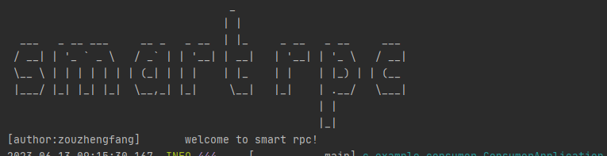
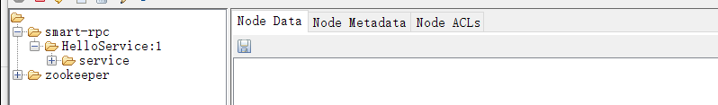

# smartrpc
一个基于Netty,SpringBoot的RPC框架

### 前言
写这个小项目的目的，一是检验平时的积累，二是学点新东西。从准备写到开始写，中间看了很多类似的开源代码，其中最最最大牌的就是dubbo了，借鉴项目的架构，以及一些具体实现的方案，收获颇多，我想，代码能力的增长，要多看，多写，在实际中更加深刻的理解一些技术。  项目很小，很粗糙，仅用于学习。

### 项目设计

项目架构图（包含未实现部分）


技术要点：

* 通过注解@Reference和@RpcService来标志服务提供方和消费方
* springboot自动配置获取配置，包含服务提供方绑定的IP和端口、序列化协议、注册中心信息
* 通过SPI+配置来选择序列化协议，注册中心，方便拓展
* 服务提供端通过注解，确定要发布的服务，通过netty开启服务，暴露服务到ZK上
* 消费端通过注解，获取ZK的服务信息，动态代理到注解的接口上
* 消费方调用服务后，通过netty传输请求到提供方，提供方收到请求后，提交线程池执行并发回结果。


### 如何使用

1. 定义公共接口:

		public interface HelloService { 
			String hello(String name); 
		}


2. 添加对应依赖
    ```xml
        <dependency>
            <groupId>com.example</groupId>
            <artifactId>smartrpc</artifactId>
            <version>0.0.1-SNAPSHOT</version>
        </dependency>
    ```

3. 配置文件
    1. 服务提供者 application 文件

        ```properties
           rpc.registry.registry=zk
           rpc.registry.address=127.0.0.1
           rpc.registry.port=2181
           rpc.protocol.name=kyro
           rpc.protocol.host=127.0.0.1
           rpc.protocol.port=7011
           server.port=8000
         ```
    2. 服务消费者 application 文件

        ```properties
           rpc.registry.registry=zk
           rpc.registry.address=127.0.0.1
           rpc.registry.port=2181
           server.port=8000
        ```
4. 服务提供方使用@RpcService标注接口实现ervice标注接口实现:version代表当前服务版本.
    ```java
          @RpcService(value = "HelloService",version = "1")
          public class HelloServiceImpl implements HelloService { 
          @Override
            public String say(String name) {
            return "hello " + name;
            }
          }
    ```

5. 服务消费者使用@Reference标记服务接口，即可注入服务实现类代理

    ```java
    @RestController
    public class HelloController {
    
        @Reference(value = "HelloService",version = "1")
        private HelloService helloService;
    
         @GetMapping("/hello/sayHello")
         public String sayHello(@RequestParam(defaultValue = "邹正方") String name){ 
            return helloService.say(name);
        }
    }
    ```
6. 启动服务端、客户端

   

   当看到这个输出表示启动成功了

   

   同时查看zk，如果有你注册的服务，表示成功了
